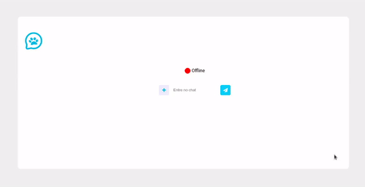

<h3 align="center">
    
</h3>
 
<p align="center"> :computer: <strong>Em progresso ...</strong> 🚧</p>

<p align="center"> 
   
  
  <a href="https://github.com/savio-2-lopes">
    
  </a>
 
 <a href="https://github.com/savio-2-lopes">
    
  </a>
</p>

<br>

## :pushpin: Índice

- [Sobre](#sobre-o-projeto)
- [Progresso](#progresso)
- [Como executar](#executar)
- [Tecnologias](#tecnologia)
- [Licença](#licenca)

<br>

<a id="sobre-o-projeto"></a>

## 💻 Sobre o projeto

:tada: Um simples Chat Real time (PetChat) utilizado WebSocket, GoLag e React.js com futuro foco para adoção de pets

<br>

<a id="executar"></a>

## 🚀 Como executar o projeto

### Pré-requisitos

Antes de começar, você vai precisar ter instalado em sua máquina as seguintes ferramentas:
[Git](https://git-scm.com), [Node.js](https://nodejs.org/en/), [GO](https://golang.org/) e o gerenciador de pacotes [Yarn](https://yarnpkg.com/).
Além disto é bom ter um editor para trabalhar com o código, como [VSCode](https://code.visualstudio.com/)
Para seu devido fucionamento, o Backend e o fronted devem está rodando.

<br>

#### 🧭 Rodando o backend

```bash

# Primeiramente, clone este repositório
$ git clone https://github.com/savio-2-lopes/go_simple_realtime_chat.git

# Entre na pasta backend
$ cd go_simple_realtime_chat/backend

# Instale a biblioteca do websocket
$ go get -u github.com/gorilla/websocket

# Após isso crie o package
$ go build main.go

# Execute o package criado
$ go run main.go

# O backend estará rodando em
$ http://localhost:3333

```

<br>

#### 🧭 Rodando o Frontend

```bash

# Entre na pasta frontend
$ cd go_simple_realtime_chat/frontend

# Instale as depedências
$ yarn

# Rode o comando
$ yarn start

```

<br>

<a id="tecnologia"></a>

## 🛠 Tecnologias

As seguintes ferramentas foram usadas na construção do projeto:

- [React.js](https://reactjs.org)
- [Go Lang](https://golang.org/)
- [websocket](github.com/gorilla/websocket)

<br>

<a id="licenca"></a>

## :memo: Licença

Este projeto está sob a licença do MIT. Veja a [página de licença](https://opensource.org/licenses/MIT) para mais detalhes.
